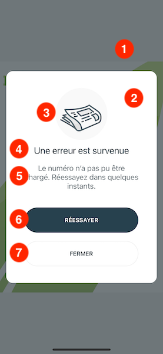
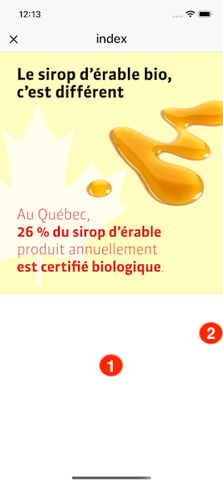
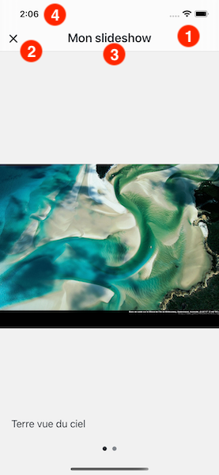
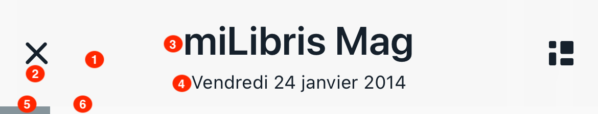
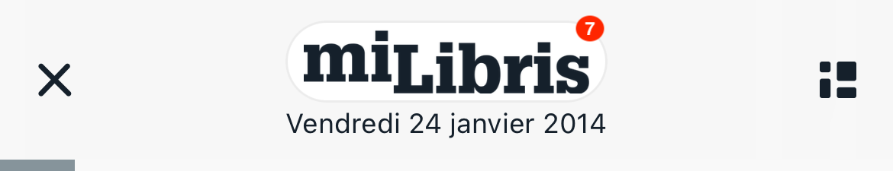
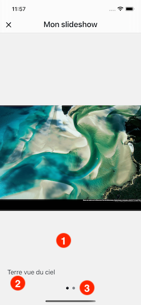

# Config reference

* [AlertConfig](#alertconfig)
* [HtmlBoxConfig](#htmlboxconfig)
* [ModalConfig](#modalconfig)
* [NavigationBarConfig](#navigationbarconfig)
* [SlideshowBoxConfig](#slideshowboxconfig)

## AlertConfig

The config for an instance of an alert.

| Badge | Name | Type | Default value | Description |
| ----- | ---- | ---- | ------------- | ----------- |
| 1 | colors.overlayBackground | UIColor | #364146 70% | The color of the overlay background. |
| 2 | colors.contentBackground | UIColor | #FFFFFF | The background color of the content. |
| 3 | images.image | UIImage? | alert-image | The image displayed in the alert. |
| 4 | colors.titleLabelText | UIColor | #1E323D | The text color of the title label. |
| 4 | fonts.titleLabel | FontInfo | System 22 | The font of the title label. |
| 5 | colors.messageLabelText | UIColor | #536067 | The text color of the message label. |
| 5 | fonts.messageLabel | FontInfo | System 18 | The font of the message label. |
| 6 | colors.primaryActionButtonBackground | UIColor | #27414E | The background color of the primary action button. |
| 6 | colors.primaryActionButtonText | UIColor | #FFFFFF | The text color of the primary action button. |
| 6 | fonts.primaryActionButton | FontInfo | System bold 14 | The font of the primary action button. |
| 7 | colors.secondaryActionButtonBorder | UIColor | #ECECEC | The border color of the secondary action button. |
| 7 | colors.secondaryActionButtonText | UIColor | #1E323D | The text color of the secondary action button. |
| 7 | fonts.secondaryActionButton | FontInfo | System bold 14 | The font of the secondary action button. |

## HtmlBoxConfig

The config for an instance of an HTML box.

| Badge | Name | Type | Default value | Description |
| ----- | ---- | ---- | ------------- | ----------- |
| 1 | colors.background | UIColor | light: #F1F1F1 / dark: #1F1F1F | The background color. |
| 2 | userInterface.scrollViewIndicatorStyle | UIScrollView.IndicatorStyle | default | The style of scroll bar indicators. |

## ModalConfig

The config for an instance of a modal screen.

| Badge | Name | Type | Default value | Description |
| ----- | ---- | ---- | ------------- | ----------- |
| 1 | colors.navigationBarBackground | UIColor | light: #F9F9F9 35% / dark: #1F1F1F 35% | The background color of the navigation bar. |
| 1 | userInterface.navigationBarBackgroundStyle | BarBackgroundStyle | translucent | The background style of the navigation bar. |
| 2 | colors.navigationBarButtonsTint | UIColor | light: #15202B / dark: #FFFFFF | The color applied to navigation bar buttons. |
| 2 | images.close | UIImage? | icn-close | The image for the close button in the navigation bar. |
| 3 | colors.navigationBarTitleText | UIColor | light: #15202B / dark: #FFFFFF | The text color of the navigation bar title. |
| 3 | fonts.navigationBarTitle | FontInfo | System bold 22 | The font of the navigation bar title. |
| 4 | userInterface.statusBarStyle | UIStatusBarStyle | default | The style of the status bar. |

## NavigationBarConfig

The config for an instance of a navigation bar.

| Badge | Name | Type | Default value | Description |
| ----- | ---- | ---- | ------------- | ----------- |
| 1 | colors.background | UIColor | light: #F9F9F9 35% / dark: #1F1F1F 35% | The background color of the navigation bar. |
| 1 | userInterface.backgroundStyle | BarBackgroundStyle | translucent | The background style of the navigation bar. |
| 2 | colors.buttonsTint | UIColor | light: #15202B / dark: #FFFFFF | The color applied to buttons. |
| 3 | colors.titleText | UIColor | light: #15202B / dark: #FFFFFF | The text color of the title. |
| 3 | fonts.title | FontInfo | System bold 26 | The font of the title. |
| 4 | colors.subtitleText | UIColor | light: #15202B / dark: #FFFFFF | The text color of the subtitle. |
| 4 | fonts.subtitle | FontInfo | System 12 | The font of the subtitle. |
| 5 | colors.progressbarBackground | UIColor | light: #F9F9F9 / dark: #000000 | The background (non filled) color of the progress bar. |
| 6 | colors.progressbarFill | UIColor | light: #86949B / dark: #B4B4B4 | The filled color of the progress bar. |
| 7 | colors.logoBackground | UIColor? | #FFFFFF | The background color of the logo. |
| 7 | colors.logoBorder | UIColor? | #ECECEC | The border color of the logo. |
| 7 | images.logo | UIImage? | nil | The brand logo to display in the reader, if no one is provided by the datasource. |

## SlideshowBoxConfig

The config for an instance of an slideshow box.

| Badge | Name | Type | Default value | Description |
| ----- | ---- | ---- | ------------- | ----------- |
| 1 | colors.background | UIColor | light: #F1F1F1 / dark: #1F1F1F | The background color. |
| 2 | colors.captionBackground | UIColor | light: #F1F1F1 50% / dark: #1F1F1F 50% | The background  color of the caption. |
| 2 | colors.captionText | UIColor | light: #15202B / dark: #FFFFFF | The text color of the caption. |
| 2 | fonts.caption | FontInfo | System 18 | The font of the caption. |
| 3 | colors.currentPageIndicatorTint | UIColor | light: #15202B / dark: #FFFFFF | The color of the selected page indicator. |
| 3 | colors.pageIndicatorTint | UIColor | light: #15202B 50% / dark: #FFFFFF 50% | The color of the page indicator. |
