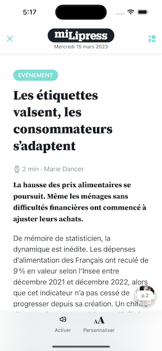
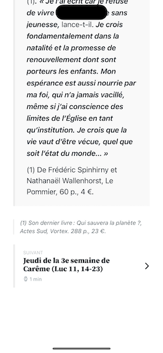

# Config reference

* [AlertConfig](#alertconfig)
* [ArticleImageConfig](#articleimageconfig)
* [ArticleReaderConfig](#articlereaderconfig)
* [ArticleSettingsConfig](#articlesettingsconfig)
* [HtmlBoxConfig](#htmlboxconfig)
* [ModalConfig](#modalconfig)
* [NavigationBarConfig](#navigationbarconfig)
* [ReaderConfig](#readerconfig)
* [ReaderTutorialConfig](#readertutorialconfig)
* [SlideshowBoxConfig](#slideshowboxconfig)
* [SummaryConfig](#summaryconfig)

## AlertConfig

The config for an instance of an alert.

| Badge | Name | Type | Default value | Description |
| ----- | ---- | ---- | ------------- | ----------- |
| 1 | colors.overlayBackground | UIColor | #364146 70% | The color of the overlay background. |
| 2 | colors.contentBackground | UIColor | #FFFFFF | The background color of the content. |
| 3 | images.image | UIImage? | alert-image | The image displayed in the alert. |
| 4 | colors.titleLabelText | UIColor | #1E323D | The text color of the title label. |
| 4 | fonts.titleLabel | FontInfo | System 22 | The font of the title label. |
| 5 | colors.messageLabelText | UIColor | #536067 | The text color of the message label. |
| 5 | fonts.messageLabel | FontInfo | System 18 | The font of the message label. |
| 6 | colors.primaryActionButtonBackground | UIColor | #27414E | The background color of the primary action button. |
| 6 | colors.primaryActionButtonText | UIColor | #FFFFFF | The text color of the primary action button. |
| 6 | fonts.primaryActionButton | FontInfo | System bold 14 | The font of the primary action button. |
| 7 | colors.secondaryActionButtonBorder | UIColor | #ECECEC | The border color of the secondary action button. |
| 7 | colors.secondaryActionButtonText | UIColor | #1E323D | The text color of the secondary action button. |
| 7 | fonts.secondaryActionButton | FontInfo | System bold 14 | The font of the secondary action button. |

## ArticleImageConfig

The config for an instance of the article image viewer.

| Badge | Name | Type | Default value | Description |
| ----- | ---- | ---- | ------------- | ----------- |
| 1 | colors.background | UIColor | light: #F1F1F1 / dark: #1F1F1F | The background color. |
| 2 | colors.buttonTint | UIColor | light: #15202B / dark: #FFFFFF | The color applied to controls. |
| 2 | images.close | UIImage? | icn-close | The image for the close button. |

## ArticleReaderConfig

The config for an instance of the article reader.

| Badge | Name | Type | Default value | Description |
| ----- | ---- | ---- | ------------- | ----------- |
| 1 | navigationBar | [NavigationBarConfig](#navigationbarconfig) | | The config for the the article reader navigation bar. |
| 1 | userInterface.statusBarStyle | UIStatusBarStyle | default | The style of the status bar. |
| 2 | images.close | UIImage? | icn-close | The image for the close button in the navigation bar. |
| 3 | summary | [SummaryConfig](#summaryConfig) | | The config for the the article reader summary. |
| 3 | images.summary | UIImage? | icn-close | The image for the summary button in the navigation bar. |
| 4 | alert | [AlertConfig](#alertConfig) | | The config for alerts displayed by the article reader. |
| 4 | colors.background | UIColor | light: #FFFFFF / dark: #1F1F1F | The background color. |
| 4 | userInterface.activityIndicatorStyle | UIActivityIndicatorView.Style | medium | The style of activity indicators. |
| 4 | userInterface.scrollViewIndicatorStyle | UIScrollView.IndicatorStyle | default | The style of scroll bar indicators. |
| 5 | articleImage | [ArticleImageConfig](#articleimageconfig) | | The config for the the article image viewer. |
| 5 | features.debugImageCrop | Bool | false | Display rectangles on images previewing image crop. |
| 5 | features.onDeviceSmartCropEnabled | Bool | true | Enable on-device smart crop for images. |
| 5 | colors.imagePlaceholder | UIColor | light: #F9F9F9 / dark: #536067 | The background color of image views when loading. |
| 6 | colors.fisheyeLabelBackground | UIColor | #FFFFFF | The background color of the fisheye label. |
| 6 | colors.fisheyeLabelText | UIColor | #15202B | The text color of the fisheye label. |
| 6 | fonts.fisheyeLabel | FontInfo | System 12 | The font for the fisheye label. |
| 7 | colors.bottomBarBackground | UIColor | light: #F9F9F9 35% / dark: #1F1F1F 35% | The background color of the bottom bar. |
| 7 | colors.bottomBarTint | UIColor | light: #15202B / dark: #FFFFFF | The color applied to controls on the bottom bar. |
| 7 | fonts.bottomBar | FontInfo | System 12 | The font for the bottom bar text. |
| 7 | userInterface.bottomBarBackgroundStyle | BarBackgroundStyle | translucent | The background style of the bottom bar. |
| 8 | features.isTextToSpeechEnabled | Bool | true | Enable text-to-speech feature in article reader. |
| 8 | images.bookmarkActivate | UIImage? | userAction_icn-save-on | The image for the activate bookmark button in the bottom bar. |
| 8 | images.bookmarkDeactivate | UIImage? | userAction_icn-save-off | The image for the deactivate bookmark button in the bottom bar. |
| 8 | images.textToSpeechActivate | UIImage? | icn-close | The image for the activate text-to-speech button in the bottom bar. |
| 8 | images.textToSpeechDeactivate | UIImage? | icn-close | The image for the deactivate text-to-speech button in the bottom bar. |
| 9 | articleSettings | [ArticleSettingsConfig](#articlesettingsconfig) | | The config for the the article settings. |
| 9 | images.settings | UIImage? | icn-close | The image for the settings button in the bottom bar. |
| 10 | images.share | UIImage? | icn-close | The image for the share button in the bottom bar. |
| 11 | colors.link | UIColor | light: #15202B / dark: #FFFFFF | The colors of links in text. |
| 11 | fonts.paragraphB | FontInfo | System Bold 18 | The font for <b> tags in paragraphs. |
| 11 | fonts.paragraphEm | FontInfo | System Italic Bold 18 | The font for <em> tags in paragraphs. |
| 11 | fonts.paragraphI | FontInfo | System Italic 18 | The font for <i> tags in paragraphs. |
| 11 | fonts.paragraphStrong | FontInfo | System Bold 18 | The font for <strong> tags in paragraphs. |
| 11 | text.dropcap | TextConfig | light: #15202B / dark: #FFFFFF / System Black 56 / line spacing 2 | The text config for dropcaps. |
| 11 | text.intertitlePhone | TextConfig | light: #15202B / dark: #FFFFFF / Source Serif Pro Bold 22 / line spacing 2 | The text config for intertitles on phones. |
| 11 | text.intertitleTablet | TextConfig | light: #15202B / dark: #FFFFFF / Source Serif Pro Bold 24 / line spacing 2 | The text config for intertitles on tablets. |
| 11 | text.paragraph | TextConfig | light: #15202B / dark: #FFFFFF / System 18 / line spacing 5 | The text config for paragraphs. |
| 12 | colors.nextArticleArrow | UIColor | light: #15202B / dark: #FFFFFF | The color used for the arrow of the next article block. |
| 12, 17, 18 | colors.separator | UIColor | light: #ECECEC / dark: #535353 | The color of the separators in content. |
| 12 | images.arrowRight | UIImage? | icn-arrow-right | The image for the arrow right indicator of the article footer. |
| 12 | text.nextArticleInfos | TextConfig | light: #86949B / dark: #878787 / System 12 / line spacing 0 | The text config used for the infos label of the next article block. |
| 12 | text.nextArticleNext | TextConfig | light: #BEC2C5 / dark: #878787 / System 11 / line spacing 0 | The text config used for the next label of the next article block. |
| 12 | text.nextArticleTitle | TextConfig | light: #15202B / dark: #FFFFFF / Source Serif Pro Black 18 / line spacing 0 | The text config used for the title label of the next article block. |
| 13 | colors.primeImageGradient | UIColor | #15202B | The color used for the prime image gradient. |
| 13 | colors.primeImageContent | UIColor | #FFFFFF | The color used for content displayed over the prime image. |
| 13 | colors.rubricBackgroundOverPrimeImage | UIColor | #FFFFFF | The background color of the rubric views when over the prime image. |
| 13 | colors.rubricTextOverPrimeImage | UIColor | #536067 | The text color of the rubric views when over the prime image. |
| 13 | images.arrowDown | UIImage? | icn-arrow-down | The image for the arrow down indicator of the article header. |
| 14 | text.caption | TextConfig | light: #86949B / dark: #BEC2C5 / System 14 / line spacing 3 | The text config for captions. |
| 14 | text.captionOverImage | TextConfig | #FFFFFF / System 12 / line spacing 3 | The text config for captions over images. |
| 14 | text.credit | TextConfig | light: #86949B / dark: #BEC2C5 / System Bold 14 / line spacing 3 | The text config for credits. |
| 14 | text.creditOverImage | TextConfig | #FFFFFF / System Bold 12 / line spacing 3 | The text config for credits over images. |
| 15 | colors.rubricBackground | UIColor | light: #1E323D / dark: #FFFFFF | The background color of the rubric views. |
| 15 | colors.rubricText | UIColor | light: #FFFFFF / dark: #536067 | The text color of the rubric views. |
| 15 | fonts.rubric | FontInfo | System Medium 14 | The font for the rubric views. |
| 15 | images.readingTime | UIImage? | fi_watch | The image for the reading time indicator. |
| 15 | text.author | TextConfig | light: #86949B / dark: #BEC2C5 / System 16 / line spacing 2 | The text config for the author. |
| 15 | text.subtheme | TextConfig | light: #86949B / dark: #BEC2C5 / System 14 / line spacing 0 | The text config for subthemes. |
| 15 | text.subtitle | TextConfig | light: #15202B / dark: #FFFFFF / System SemiBold 14 / line spacing 3 | The text config for the subtitle. |
| 15 | text.surtitle | TextConfig | light: #15202B / dark: #FFFFFF / System SemiBold 14 / line spacing 3 | The text config for the surtitle. |
| 15 | text.titlePhone | TextConfig | light: #15202B / dark: #FFFFFF / Source Serif Pro Black 32 / line spacing 1 | The text config for the title on phones. |
| 15 | text.titleTablet | TextConfig | light: #15202B / dark: #FFFFFF / Source Serif Pro Black 48 / line spacing 1 | The text config for the title on tablets. |
| 16 | text.heading | TextConfig | light: #15202B / dark: #FFFFFF / Source Serif Pro Black 18 / line spacing 5 | The text config for headings. |
| 17 | colors.sectionBackground | UIColor | light: #F9F9F9 / dark: #393939 | The background color of sections. |
| 18 | text.note | TextConfig | light: #536067 / dark: #FFFFFF / Source Italic 14 / line spacing 3 | The text config for notes. |
| | text.interviewAnswer | TextConfig | light: #15202B / dark: #FFFFFF / System 18 / line spacing 5 | The text config for interview answers. |
| | text.interviewQuestion | TextConfig | light: #15202B / dark: #FFFFFF / Source Serif Pro Bold 20 / line spacing 4 | The text config for interview questions. |
| | text.quote | TextConfig | light: #15202B / dark: #FFFFFF / Source Serif Pro Bold 24 / line spacing 4 | The text config for quotes. |
| | text.quoteAuthor | TextConfig | light: #86949B / dark: #BEC2C5 / Source Serif Pro Bold 18 / line spacing 7 | The text config for quote authors. |

## ArticleSettingsConfig

The config for an instance of the article settings.

| Badge | Name | Type | Default value | Description |
| ----- | ---- | ---- | ------------- | ----------- |
| 1 | colors.overlayBackground | UIColor | light: #000000 40% / dark: #606060 40% | The background color of the overlay when showing content over a screen. |
| 2 | colors.background | UIColor | light: #FFFFFF / dark: #1F1F1F | The background color. |
| 3 | colors.fontSizeDisabled | UIColor | light: #ECECEC / dark: #333333 | The color of the font size buttons when disabled. |
| 3 | colors.fontSizeEnabled | UIColor | light: #86949B / dark: #606060 | The color of the font size buttons when enabled. |
| 3 | colors.fontSizeImage | UIColor | light: #1E323D / dark: #FFFFFF | The color of the font size image. |
| 3 | images.fontSizeA | UIImage? | fontSize_A | The image for the font size action (A). |
| 3 | images.fontSizeMinus | UIImage? | fontSize_minus | The image for the font size action (minus). |
| 3 | images.fontSizePlus | UIImage? | fontSize_plus | The image for the font size action (plus). |
| 4 | colors.lineSpacingDisabled | UIColor | light: #ECECEC / dark: #333333 | The color of the line spacing buttons when disabled. |
| 4 | colors.lineSpacingEnabled | UIColor | light: #1E323D / dark: #FFFFFF | The color of the line spacing buttons when enabled. |
| 4 | images.lineSpacingLess | UIImage? | lineSpacing_less | The image for the line spacing action (less). |
| 4 | images.lineSpacingMore | UIImage? | lineSpacing_more | The image for the line spacing action (more). |
| 5 | colors.userInterfaceStyleBorder | UIColor | light: #ECECEC / dark: #333333 | The border color of the user interface style buttons when not selected. |
| 5 | colors.userInterfaceStyleBorderSelected | UIColor | light: #536067 / dark: #606060 | The border color of the user interface style buttons when selected. |
| 5 | images.userInterfaceStyleAuto | UIImage? | uistyle_auto | The image for the user interface style action (auto). |
| 5 | images.userInterfaceStyleBorder | UIImage? | uistyle_border | The image for the user interface style action (border). |
| 5 | images.userInterfaceStyleDark | UIImage? | uistyle_dark | The image for the user interface style action (dark). |
| 5 | images.userInterfaceStyleLight | UIImage? | uistyle_light | The image for the user interface style action (light). |
| 6 | colors.brightnessImages | UIColor | light: #1E323D / dark: #606060 | The color applied to images of the brightness control. |
| 6 | colors.brightnessMin | UIColor | light: #536067 / dark: #606060 | The color applied to the minimum part of the brightness control. |
| 6 | colors.brightnessMax | UIColor | light: #BEC2C5 / dark: #FFFFFF | The color applied to the maximum part of the brightness control. |
| 6 | images.brightnessMin | UIImage? | brightness_min | The image for the brightness action (minimum). |
| 6 | images.brightnessMax | UIImage? | brightness_max | The image for the brightness action (maximum). |
| 7 | colors.separator | UIColor | light: #ECECEC / dark: #333333 | The separator color. |

## HtmlBoxConfig

The config for an instance of an HTML box.

| Badge | Name | Type | Default value | Description |
| ----- | ---- | ---- | ------------- | ----------- |
| 1 | colors.background | UIColor | light: #F1F1F1 / dark: #1F1F1F | The background color. |
| 2 | userInterface.scrollViewIndicatorStyle | UIScrollView.IndicatorStyle | default | The style of scroll bar indicators. |

## ModalConfig

The config for an instance of a modal screen.

| Badge | Name | Type | Default value | Description |
| ----- | ---- | ---- | ------------- | ----------- |
| 1 | colors.navigationBarBackground | UIColor | light: #F9F9F9 35% / dark: #1F1F1F 35% | The background color of the navigation bar. |
| 1 | userInterface.navigationBarBackgroundStyle | BarBackgroundStyle | translucent | The background style of the navigation bar. |
| 2 | colors.navigationBarButtonsTint | UIColor | light: #15202B / dark: #FFFFFF | The color applied to navigation bar buttons. |
| 2 | images.close | UIImage? | icn-close | The image for the close button in the navigation bar. |
| 3 | colors.navigationBarTitleText | UIColor | light: #15202B / dark: #FFFFFF | The text color of the navigation bar title. |
| 3 | fonts.navigationBarTitle | FontInfo | System bold 22 | The font of the navigation bar title. |
| 4 | userInterface.statusBarStyle | UIStatusBarStyle | default | The style of the status bar. |

## NavigationBarConfig

The config for an instance of a navigation bar.

| Badge | Name | Type | Default value | Description |
| ----- | ---- | ---- | ------------- | ----------- |
| 1 | colors.background | UIColor | light: #F9F9F9 35% / dark: #1F1F1F 35% | The background color of the navigation bar. |
| 1 | userInterface.backgroundStyle | BarBackgroundStyle | translucent | The background style of the navigation bar. |
| 2 | colors.buttonsTint | UIColor | light: #15202B / dark: #FFFFFF | The color applied to buttons. |
| 3 | colors.titleText | UIColor | light: #15202B / dark: #FFFFFF | The text color of the title. |
| 3 | fonts.title | FontInfo | System bold 26 | The font of the title. |
| 4 | colors.subtitleText | UIColor | light: #15202B / dark: #FFFFFF | The text color of the subtitle. |
| 4 | fonts.subtitle | FontInfo | System 12 | The font of the subtitle. |
| 5 | colors.progressbarBackground | UIColor | light: #F9F9F9 / dark: #000000 | The background (non filled) color of the progress bar. |
| 6 | colors.progressbarFill | UIColor | light: #86949B / dark: #B4B4B4 | The filled color of the progress bar. |
| 7 | colors.logoBackground | UIColor? | #FFFFFF | The background color of the logo. |
| 7 | colors.logoBorder | UIColor? | #ECECEC | The border color of the logo. |
| 7 | images.logo | UIImage? | nil | The brand logo to display in the reader, if no one is provided by the datasource. |

## ReaderConfig

The config for an instance of the reader.

| Badge | Name | Type | Default value | Description |
| ----- | ---- | ---- | ------------- | ----------- |
| 1 | alert | [AlertConfig](#alertConfig) | | The config for alerts displayed by the reader. |
| 1 | htmlBox | [HtmlBoxConfig](#htmlboxconfig) | | The config for an instance of an HTML box. |
| 1 | modal | [ModalConfig](#modalconfig) | | The config for the reader modals. |
| 1 | readerTutorial | [ReaderTutorialConfig](#readertutorialconfig) | | The config for the reader tutorial. |
| 1 | slideshowBox | [SlideshowBoxConfig](#slideshowboxconfig) | | The config for an instance of a slideshow box. |
| 1 | features.debugBoxes | Bool | false | Display boxes position with a transparent overlay. |
| 1 | features.isDoublePagesEnabled | Bool | true | If false, always display single pages, even in landscape. |
| 1 | features.longPressArticlesEnabled | Bool | true | Enable the long press gesture to open articles. |
| 1 | features.paddingForZoomingOnBoxes | CGFloat | 5 | The padding to apply when zooming on boxes. |
| 1 | userInterface.supportedInterfaceOrientations | UIInterfaceOrientationMask | icn-arrow-up | The interface orientations supported by the reader. |
| 1 | colors.boxHighlight | UIColor | #BEC2C5 25% | The color used to highlight boxes on page turn. |
| 1 | colors.pagePlaceholder | UIColor | light: #F9F9F9 / dark: #536067 35% | The background color of pages when loading. |
| 1 | userInterface.activityIndicatorStyle | UIActivityIndicatorView.Style | icn-arrow-up | The style of activity indicators. |
| 2 | colors.articleCapsuleHiddenBackground | UIColor | light: #F1F1F1 / dark: #1F1F1F | The background color of the article capsule when the bottom sheet is in the "hidden" position. |
| 2 | colors.articleCapsuleHiddenText | UIColor | light: #536067 / dark: #B4B4B4 | The text color of the article capsule when the bottom sheet is in the "hidden" position. |
| 2 | colors.noArticlesBackground | UIColor | light: #F1F1F1 / dark: #1F1F1F | The background color of the "no articles" view. |
| 2 | colors.noArticlesText | UIColor | light: #536067 / dark: #B4B4B4 | The text color of the "no articles" view. |
| 2 | fonts.articleCapsuleArticles | FontInfo | System bold 12 | The font of the article capsule in the "articles" state. |
| 2 | fonts.articleCapsuleNoArticles | FontInfo | System 14 | The font  of the article capsule in the "no articles" state. |
| 2 | images.articleCapsuleArrowUp | UIImage? | icn-arrow-up | The image for the arrow up indicator of the article capsule in the "articles" state. |
| 3 | colors.background | UIColor | light: #F1F1F1 / dark: #1F1F1F | The background color. |
| 4 | navigationBar | [NavigationBarConfig](#navigationbarconfig) | | The config for the reader navigation bar. |
| 4 | userInterface.statusBarStyle | UIStatusBarStyle | icn-arrow-up | The style of the status bar. |
| 5 | images.close | UIImage? | icn-close | The image for the close button in the navigation bar. |
| 6 | summary | [SummaryConfig](#summaryconfig) | | The config for the reader summary. |
| 6 | images.summary | UIImage? | icn-summary | The image for the summary button in the navigation bar. |
| 7 | colors.actionButtonBackgroundColor | UIColor | light: #536067 / dark: #B4B4B4 | The background color of the action buttons on pages. |
| 7 | colors.actionButtonTintColor | UIColor | light: #F1F1F1 / dark: #F1F1F1 | The tint color of the action buttons on pages. |
| 7 | colors.articleCapsuleBottomBackground | UIColor | light: #536067 / dark: #B4B4B4 | The background color of the article capsule when the bottom sheet is in the "bottom" position. |
| 7 | colors.articleCapsuleBottomText | UIColor | light: #F1F1F1 / dark: #F1F1F1 | The text color of the article capsule when the bottom sheet is in the "bottom" position. |
| 7 | images.print | UIImage? | icn-print | The image for the print action button. |
| 7 | features.printPageEnabled | Bool | false | Add a print page button. |
| 8 | features.debugImageCrop | Bool | false | Display rectangles on images previewing image crop. |
| 8 | colors.flatplanImagePlaceholder | UIColor | light: #EBEDED / dark: #313638 | The background color of flatplan images while they are loading. |
| 8 | colors.flatplanSelectedBorder | UIColor | light: #536067 / dark: #B4B4B4 | The color of the border in the flatplan when selected. |
| 8 | colors.flatplanSelectedTitleText | UIColor | light: #536067 / dark: #B4B4B4 | The color of the text in the flatplan when selected. |
| 8 | colors.flatplanTitleText | UIColor | light: #15202B / dark: #FFFFFF | The color of the text in the flatplan when not selected. |
| 8 | fonts.flatplanTitle | FontInfo | System 12 | The font of the text in the flatplan. |
| 9 | colors.bottomSheetDragIndicator | UIColor | light: #86949B / dark: #BEC2C5 | The color of the bottom sheet drag indicator view. |
| 10 | articleReader | [ArticleReaderConfig](#articlereaderconfig) | | The config for the article reader. |
| 10 | features.onDeviceSmartCropEnabled | Bool | true | Enable on-device smart crop for images. |
| 10 | colors.bottomSheetBackground | UIColor | light: #F9F9F9 35% / dark: #1F1F1F 35% | The background color of the bottom sheet. |
| 10 | colors.miniSummaryCellPlaceholder | UIColor | light: #BEC2C5 45% / dark: #536067 45% | The color of the label placeholders in the mini-summary while loading. |
| 10 | colors.miniSummaryCellTitleText | UIColor | light: #1E323D / dark: #FFFFFF | The color of the cell title in the mini-summary. |
| 10 | colors.miniSummaryImagePlaceholder | UIColor | light: #EBEDED / dark: #313638 | The background color of mini-summary images while they are loading. |
| 10 | colors.miniSummarySelectedBackground | UIColor? | nil | The selected background color of cells in the mini-summary. |
| 10 | colors.miniSummarySeparator | UIColor? | nil | The separator color in the mini-summary. |
| 10 | fonts.miniSummaryCellTitle | FontInfo | System bold 16 | The font of the cell title in the mini-summary. |
| 10 | userInterface.bottomSheetBackgroundStyle | BarBackgroundStyle | icn-arrow-up | The background style of the bottom sheet. |
| 10 | userInterface.scrollViewIndicatorStyle | UIScrollView.IndicatorStyle | icn-arrow-up | The style of scroll bar indicators. |

## ReaderTutorialConfig

The config for the tutorial of the reader.

| Badge | Name | Type | Default value | Description |
| ----- | ---- | ---- | ------------- | ----------- |
| 1 | colors.closeButtonBackground | UIColor | #000000 35% | The background color of the close button. |
| 1 | colors.closeButtonTint | UIColor | #FFFFFF | The color applied to the close button. |
| 1 | images.close | UIImage? | icn-close | The image for the close button. |
| 2 | colors.imageBackground | UIColor | #ACB9BD | The background color of an item image. |
| 3 | images.itemWelcome | UIImage? | readerTutorial_welcome | The image for the welcome item. |
| 3 | images.itemReader | UIImage? | readerTutorial_reader | The image for the reader item. |
| 3 | images.itemArticles | UIImage? | readerTutorial_articles | The image for the articles item. |
| 3 | images.itemSummary | UIImage? | readerTutorial_summary | The image for the summary item. |
| 3 | images.itemArticleReader | UIImage? | readerTutorial_articleReader | The image for the articleReader item. |
| 3 | images.itemShare | UIImage? | readerTutorial_share | The image for the share item. |
| 4 | colors.articleCapsuleBackground | UIColor | #8CA4B0 | The background color of the article capsule. |
| 4 | colors.articleCapsuleText | UIColor | #FFFFFF | The text color of the article capsule. |
| 4 | fonts.articleCapsule | FontInfo | System bold 10 | The font of the article capsule. |
| 5 | colors.itemTitleText | UIColor | light: #1E323D, dark: #FFFFFF | The text color of an item title. |
| 5 | fonts.itemTitleBigPhone | FontInfo | System bold 20 | The font of an item title (big + phone). |
| 5 | fonts.itemTitleBigTablet | FontInfo | System bold 22 | The font of an item title (big + tablet). |
| 5 | fonts.itemTitleRegular | FontInfo | System 14 | The font of an item title (regular). |
| 6 | colors.itemDescriptionText | UIColor | light: #536067, dark: #FFFFFF | The text color of an item description. |
| 6 | fonts.itemDescription | FontInfo | System 14 | The font of an item description. |
| 7 | colors.currentPageIndicatorTint | UIColor | #5C6975 | The color of the selected page indicator. |
| 7 | colors.pageIndicatorTint | UIColor | light: #BEC2C5, dark: #ECECEC | The color of the page indicator. |
| 8 | colors.skipButtonText | UIColor | light: #536067, dark: #FFFFFF | The text color of the skip button. |
| 8 | fonts.skipButton | FontInfo | System bold 12 | The font of skip button. |
| 9 | colors.contentBackground | UIColor | light: #FFFFFF, dark: #4E5559 | The background color of the content. |
| 10 | colors.overlayBackground | UIColor | #000000 70% | The color of the overlay background. |

## SlideshowBoxConfig

The config for an instance of an slideshow box.

| Badge | Name | Type | Default value | Description |
| ----- | ---- | ---- | ------------- | ----------- |
| 1 | colors.background | UIColor | light: #F1F1F1 / dark: #1F1F1F | The background color. |
| 2 | colors.captionBackground | UIColor | light: #F1F1F1 50% / dark: #1F1F1F 50% | The background  color of the caption. |
| 2 | colors.captionText | UIColor | light: #15202B / dark: #FFFFFF | The text color of the caption. |
| 2 | fonts.caption | FontInfo | System 18 | The font of the caption. |
| 3 | colors.currentPageIndicatorTint | UIColor | light: #15202B / dark: #FFFFFF | The color of the selected page indicator. |
| 3 | colors.pageIndicatorTint | UIColor | light: #15202B 50% / dark: #FFFFFF 50% | The color of the page indicator. |

## SummaryConfig

The config for an instance of the summary.

| Badge | Name | Type | Default value | Description |
| ----- | ---- | ---- | ------------- | ----------- |
| 1 | images.close | UIImage? | icn-close | The image for the close button in the navigation bar. |
| 2 | navigationBar | [NavigationBarConfig](#navigationbarconfig) | | The config for the the summary navigation bar. |
| 3 | colors.rubricBackground | UIColor | light: #536067 / dark: #606060 | The background color of rubric views. |
| 3 | colors.rubricText | UIColor | #FFFFFF | The text color of rubric views. |
| 3 | fonts.rubric | FontInfo | System bold 12 | The font of rubric views. |
| 4 | colors.cellTitleText | UIColor | light: #1E323D / dark: #FFFFFF | The color of the title in article cells. |
| 4 | fonts.cellTitle | FontInfo | System bold 16 | The font of the title in article cells. |
| 5 | colors.cellSubtitleText | UIColor | light: #86949B / dark: #BEC2C5 | The color of the subtitle in article cells. |
| 5 | fonts.cellSubtitle | FontInfo | System 14 | The font of the subtitle in article cells. |
| 6, 10, 11 | colors.cellFooterText | UIColor | light: #536067 / dark: #ECECEC | The color of footer text in article cells. |
| 6 | fonts.cellFooter | FontInfo | System 12 | The font of footer text in article cells. |
| 6 | images.readingTime | UIImage? | fi_watch | The image for reading time indicator in cells. |
| 7 | userInterface.scrollViewIndicatorStyle | UIScrollView.IndicatorStyle | default | The style of scroll bar indicators. |
| 8 | colors.background | UIColor | light: #FFFFFF / dark: #1F1F1F | The background color. |
| 9 | colors.selectedBackground | UIColor? | nil | The background color of selected cells. Uses iOS default if nil. |
| 10 | images.bookmarkOff | UIImage? | userAction_icn-save-off | The image for bookmark button in cells (OFF). |
| 11 | images.bookmarkOn | UIImage? | userAction_icn-save-on | The image for bookmark button in cells (ON). |
| 12 | colors.imagePlaceholder | UIColor | light: #F9F9F9 / dark: #536067 | The background color of image views when loading. |
| 12 | features.debugImageCrop | Bool | false | Display rectangles on images previewing image crop. |
| 13 | colors.separator | UIColor | light: #ECECEC / dark: #333333 | The cell separator color. |
| 14 | colors.overlayBackground | UIColor | light: #000000 40% / dark: #606060 40% | The background color of the overlay when showing content over a screen. |
| 15 | colors.rubricPlaceholder | UIColor | light: #ECECEC / dark: #333333 | The text color of rubric views while loading. |
| 16 | colors.cellPlaceholder | UIColor | light: #ECECEC / dark: #333333 | The color of the label placeholders while loading. |
